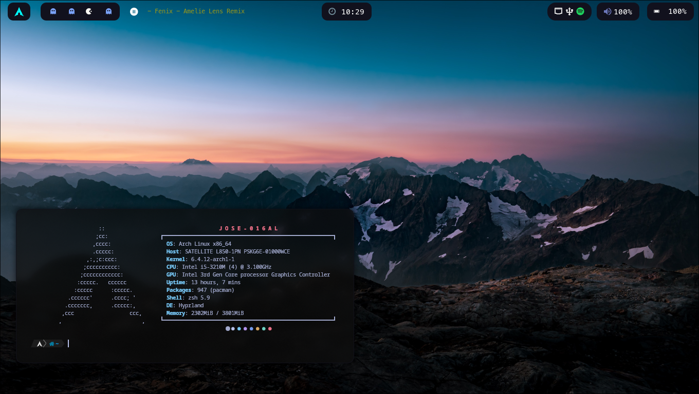

# ArchLinux & Hyprland



# Tabla de contenidos
- [ArchLinux](#arch-linux)
  - [Instalacion de ArchLinux](#instalacion-de-archlinux)
    - [Conexion wifi](#conexion-wifi)
    - [Particiones y formato de disco](#particionar-y-formatear-el-disco)
    - [Instalar paquetes esenciales](#instalar-paquetes-esenciales)
    - [Instalacion del gestor de arranque](#instalacion-del-gestor-de-arranque)
    - [Antes de reiniciar](#antes-de-reiniciar)
  - [Configuracion adicional de Arch Linux](#configuracion-adicional-de-arch-linux)
- [Hyprland](#hyprland)
  - [Instalacion de Hyprland](#instalacion-de-hyprland)
  - [Instalacion y config automatica](#instalacion-y-config-automatica)
  - [Instalacion paquetes necesarios para Hyprland](#instalacion-paquetes-necesarios-para-hyprland)
  - [Mi configuracion](#mi-configuracion)
  - [Creditos](#creditos)

# Enlaces a consultar
- **[Gnome-Look](https://www.gnome-look.org/s/Gnome/browse/)**
- **[Hyprland docs](https://hyprland.org/)**
- **[Mejorar los mirrors](https://salmorejogeek.com/2016/11/18/usando-reflector-para-descargar-mas-rapido-de-los-mirros-de-arch-antergos/)**
- **[Nerd Fonts](https://www.nerdfonts.com/cheat-sheet)**
- **[Instalar Docker](https://linuxhint.com/arch-linux-docker-tutorial/)**
- **[Problemas con las llaves](https://superlativoblog.wordpress.com/2017/01/06/solucion-al-problema-de-llaves-actualizando-arch-o-derivadas/)**

# Arch Linux

## Instalacion de ArchLinux 
Como la instalacion puede cambiar, lo mejor seria diriginos directamente a la [guide installation](https://wiki.archlinux.org/title/Installation_guide_(Espa%C3%B1ol)) y seguir paso a paso la guia de instalacion de archlinux  

Es posible que nos salga el tamaño de fuente demasiado pequeño, por ahora podemos configurar esto con este comando
```bash
setfont ter-118n
```

### Conexion wifi
```bash
iwctl
```
```bash
station wlan0 scan       
```
```bash
station wlan0 get-networks
```
```bash
station wlan0 connect SSID
```

### Particionar y formatear el disco
Usaremos cfdisk por su comodidad
```bash
cfdisk
```
Para realizar un dual boot tendremos que crear una particion EFI 
```bash
mkfs.vfat -F 32 /dev/nvme0n1p6
```
Particionamos el disco usando cfdisk  
    - 150 MB - EFI SYSTEM  
    - 15 GB - SWAP  
    - RESTO - /  
podemos ver las particiones fuera de cfdisk con
```bash
lsblk
```
Formateamos la particion swap
```bash
mkswap /dev/sda2
```
```bash
swapon /dev/sda2
```
Formateamos las particiones: /
```bash
mkfs.ext4 /dev/sda3
```
Una vez terminado el particionado del disco si queremos un dual boot podemos seguir la instlaacion con el script de archinstall  
     
Montamos los sistemas de archivos
```bash
mount /dev/sda3 /mnt
```
Montamos la particion de EFI 
```bash
mount --mkdir /dev/sda1 /mnt/boot
```

### Instalar paquetes esenciales
Algunos paquetes quizas no sean esenciales pero podemos aprovechar e instalarlos ya
```bash
pacstrap /mnt base base-devel linux linux-firmware networkmanager sudo grub efibootmgr nano iwd git
```

### Instalacion del gestor de arranque
Procedemos con la configuracion del grub
Configuramos el grub
```bash
grub-install --target=x86_64-efi --efi-directory=/boot
```
```bash
grub-mkconfig -o /boot/grub/grub.cfg
```

### Antes de reiniciar
Asegurarse de habilitar el servicio networkManager
```bash
systemctl enable NetworkManager
```
Una vez hecho esto ya podemos salir de la instalacion
```bash
exit
```
```bash
umount -R /mnt
```
Y reiniciamos el sistema, si nos sale el gestor de arranque de Arch habra salido todo bien
```bash
reboot
```

## Configuracion adicional de Arch Linux
Editamos el archivo hosts
```bash
nano /etc/hosts

127.0.0.1	localhost   
::1		    localhost    
127.0.1.1	ArchLinux.localhost	ArchLinux      
```
Creacion de un nuevo usuario
```bash
useradd -m jose
```
```bash
passwd jose
```
```bash
usermod -aG wheel,video,audio,storage jose
```
tendremos que configurar el archivo sudoers para poder ser root
```bash
nano /etc/sudoers
```
Para poder instalar entornos de escritorio necesitamos instalar xorg
```bash
sudo pacman -S xorg xorg-server
```
Ahora generamos nuestras carpetas personales básicas (Escritorio, Descargas, Música, Etc.).
Para esto instalamos la herramienta xdg-user-dirs:
```bash
sudo pacman -S xdg-user-dirs
```
Por ultimo lo ejecutamos para que nos genere nuestras carpetas.
```bash
xdg-user-dirs-update
```

# Hyprland

## Instalacion y config automatica
Podemos ejecutar el script "install.sh", si deseamos hacer la instalacion de todos los paquetes necesarios de forma automatica y copiar los dotfiles
```bash
./install.sh
```
Posteriormente a esto haremos un reinicio, si decidimos realizar el script ya habremos terminado

## Instalacion de Hyprland
Para poder instalar hyprland necesitamos yay
```bash 
git clone https://aur.archlinux.org/yay.git
```
```bash
cd yay
```
```bash
makepkg -si # si este comando no va necesitaremos instalar base-devel por medio de pacman
```
Instalamos Qtile y el logging manager
```bash
yay -S hyprland kitty brave-bin
```
```bash
sudo pacman -S sddm
```
```bash
systemctl enable sddm
```

## Instalacion paquetes necesarios para Hyprland
Una vez ya este instalado hyprland, ya podremos instalar los paquetes que necesitamos (algunos de estos paquetes no son necesarios)
```bash
sudo pacman -S rofi waybar unzip pavucontrol pamixer xautolock hyprpaper nemo cinnamon-translations grim slurp swappy dunst zsh bat lsd neofetch wget udisks2 udiskie ntfs-3g vlc network-manager-applet spotify-launcher pacman-contrib
```
```bash
yay -S sddm-theme-sugar-candy-git wl-clip-persist swaylock-effects xviewer zsh-syntax-highlighting zsh-autosuggestions nwg-look telegram-desktop-bin visual-studio-code-bin autofirma configuradorfnmt onedriver xfce4-power-manager gnome-disk-utility evince whatsapp-for-linux light
```

## Mi configuracion
Para mantener la misma configracion del entorno de escritorio
```bash
git clone git@github.com:jose-016al/Hyprland.git
```
```bash
cd Hyprland
```
Copiamos el directorio .config
```bash
cp -r dotfiles ~/
```

## Creditos 
<p>Agradecimientos a @<a href="https://github.com/f3l3p1n0">f3l3p1n0</a> por los dotfiles iniciales. Mi trabajo se basa en sus contribuciones.</p>
<p><a href="https://github.com/f3l3p1n0/bluehypr">BlueHypr - f3l3p1n0</a></p>
